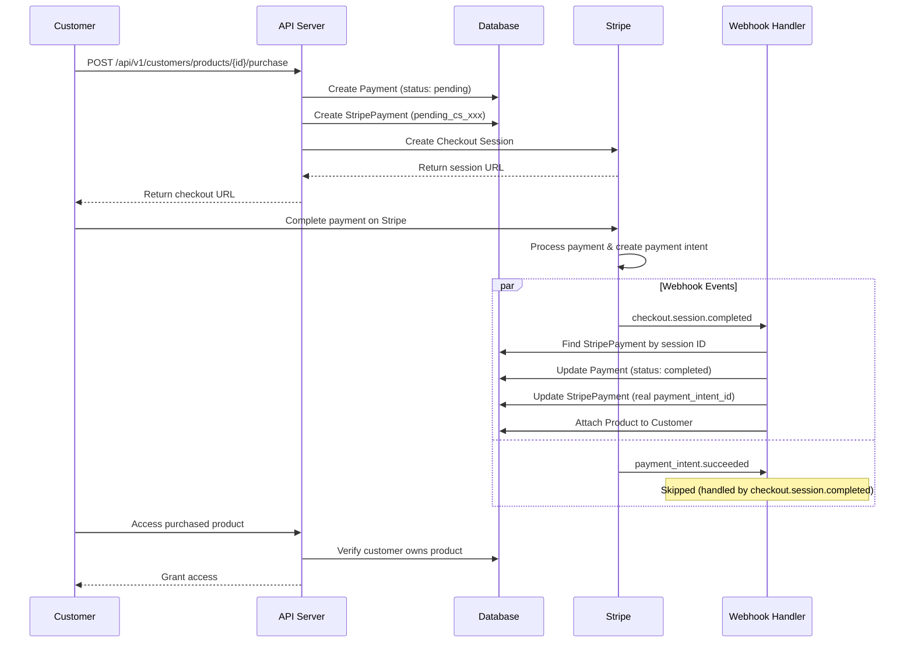
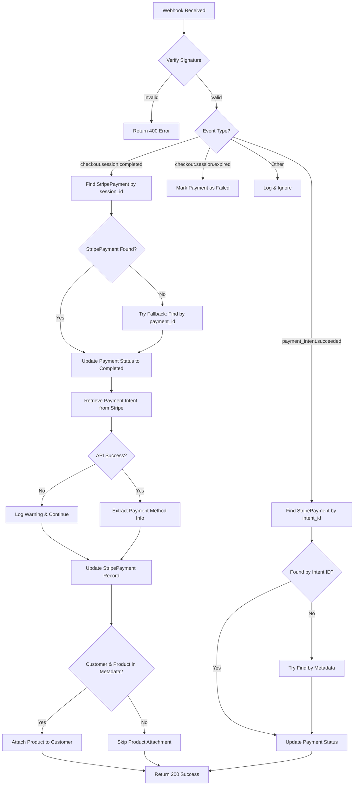
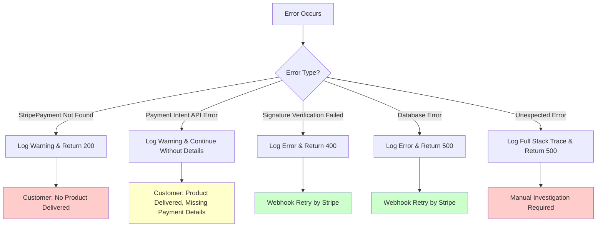
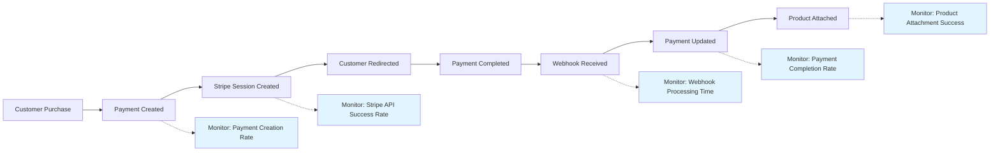

# Stripe Payment Flow - Visual Diagram

This document provides visual representations of the payment flow to complement the main documentation.

## High-Level Flow Diagram



## Database State Changes

### Initial State (After Purchase Request)

```
payments:
├── id: 1
├── status: 'pending'
├── product_id: 4
├── customer_id: 2 (in metadata)
└── ...

stripe_payments:
├── id: 1
├── payment_id: 1
├── stripe_payment_intent_id: 'pending_cs_test_123'
├── stripe_metadata: {
│   ├── checkout_session_id: 'cs_test_123'
│   └── ...
└── }

customer_product: (empty)
```

### Final State (After Webhook Processing)

```
payments:
├── id: 1
├── status: 'completed' ← UPDATED
├── product_id: 4
├── customer_id: 2 (in metadata)
└── ...

stripe_payments:
├── id: 1
├── payment_id: 1
├── stripe_payment_intent_id: 'pi_real_intent_123' ← UPDATED
├── stripe_customer_id: 'cus_stripe_123' ← UPDATED
├── stripe_payment_method_id: 'pm_card_123' ← UPDATED
├── stripe_metadata: {
│   ├── checkout_session_id: 'cs_test_123'
│   ├── payment_intent_id: 'pi_real_intent_123' ← ADDED
│   ├── customer_email: 'customer@example.com' ← ADDED
│   └── ...
└── }

customer_product: ← NEW RECORD
├── customer_id: 2
├── product_id: 4
├── payment_id: 1
└── purchased_at: '2025-01-XX XX:XX:XX'
```

## Webhook Event Processing Flow



## Error Handling Paths



## Key Integration Points

### 1. Customer Controller → Stripe API

```
CustomerController@purchase
    ↓
StripeService@getStripeClient()
    ↓
Stripe\Checkout\Session::create()
    ↓
Return checkout URL to customer
```

### 2. Webhook Controller → Service Layer

```
StripeWebhookController@handle
    ↓
Webhook signature verification
    ↓
Event type routing
    ↓
StripeService@handleWebhook()
    ↓
Specific event handlers
```

### 3. Database Consistency Flow

```
Payment Record Creation
    ↓ (immediate)
StripePayment Record Creation
    ↓ (via webhook)
Payment Status Update
    ↓ (via webhook)
StripePayment ID Update
    ↓ (via webhook)
Customer-Product Relationship
```

## Timing Considerations

### Typical Event Timeline

```
T+0s:    Customer initiates purchase
T+1s:    Database records created
T+2s:    Stripe checkout session created
T+3s:    Customer redirected to Stripe
T+30s:   Customer completes payment
T+31s:   Stripe processes payment
T+32s:   checkout.session.completed webhook sent
T+33s:   payment_intent.succeeded webhook sent
T+34s:   Our system processes webhooks
T+35s:   Customer has access to product
```

### Race Condition Mitigation

- **Multiple lookup strategies** for finding StripePayment records
- **Graceful error handling** for Stripe API failures
- **Idempotent product attachment** to prevent duplicates
- **Comprehensive logging** for debugging timing issues

## Monitoring Points



This visual documentation should be used alongside the main `stripe-payment-flow.md` file for a complete understanding of the payment system.
